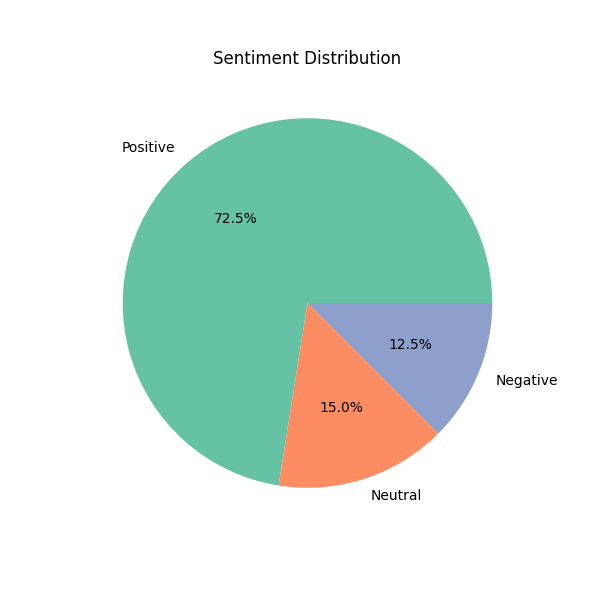
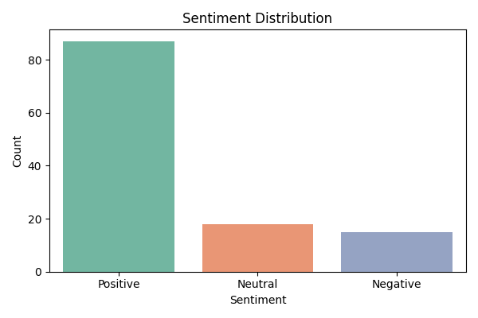

# 🧠 Feedback Sentiment Analyzer

An end-to-end **Sentiment Analysis & Feedback Insights** project built during my internship at **Ajinkya Creation Pvt. Ltd.**  
This Streamlit-powered app lets users **upload their own CSV files** and instantly visualize customer sentiment — Positive, Negative, or Neutral — in a clean, interactive dashboard.

  

---

## 📌 Project Overview

> **Goal:** Convert raw feedback into real-time emotional insights using NLP & data visualization.  
> Whether it's from e-learning platforms, surveys, or forms — plug in your `.csv` file and see the story behind the words.<br>
> **Make sure your CSV has a column named Feedback**

---

## 🚀 Live App

👉 [Launch the App on Streamlit Cloud](https://feedback-sentiment-analyzer-2bebweigj8e9qwsuqe5wqp.streamlit.app/)

---

## ✨ Key Features

🎯 **CSV Upload:** Users can upload their own `.csv` files with a `Feedback` column.  
📊 **Real-time Sentiment Analysis:** Feedback is instantly categorized into Positive, Negative, or Neutral using **TextBlob**.  
📌 **Dashboard Cards:** Clean KPI cards show count of each sentiment type.  
📈 **Dynamic Charts:** Pie and bar charts reflect live sentiment distribution.  
🎬 **Lottie Animations:** Minimalist animations make the UI engaging and fun.  
🧾 **Business Summary:** Automatic text-based analysis from the sentiment spread.

---

## 📁 Project Structure

FeedbackSentimentAnalyzer/ <br>
├── Data/ # feedback_sample_v2.csv (raw input data) <br>
├── SRC/ # main.py (core logic, sentiment code, plots) <br>
├── Report/ # Visual charts + text summary <br>
├── README.md # You’re here! <br>
├── requirements.txt # Python libraries <br>
└── .gitignore # Ignored files <br>

## 📊 Tech Stack

- **Frontend**: Streamlit, LottieFiles
- **Backend**: Python (Pandas, NumPy, TextBlob, Matplotlib)
- **IDE**: VS Code
- **Hosting**: Streamlit Cloud

## 🖼️ Visual Preview

| Lottie Animated UI     | Sentiment Dashboard Cards     | Pie + Bar Charts              |
|------------------------|-------------------------------|-------------------------------|
|  | `Positive: 152`<br>`Neutral: 63`<br>`Negative: 85` | <br> |

---

## 💼 Real-World Impact

In platforms like LXPs or EdTech dashboards, this tool can:

- Instantly evaluate feedback from users or students
- Flag areas/modules generating negative sentiment
- Track feedback trends over time
- Support internal review meetings with auto-generated visual reports

---

## 📥 Sample Dataset

You can [download the sample feedback CSV](https://raw.githubusercontent.com/tannistha12/FeedbackSentimentAnalyzer/main/Data/feedback_sample_v2.csv) to test the app locally or upload it on the deployed Streamlit site.

> ✨ File: `Data/feedback_sample_v2.csv`

---

## 🛠 How to Run Locally

```bash
git clone https://github.com/your-username/feedback-sentiment-analyzer.git
cd feedback-sentiment-analyzer/src
pip install -r ../requirements.txt
streamlit run app.py

